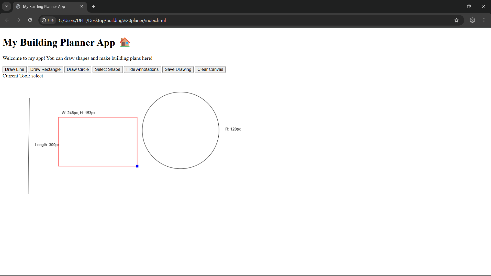
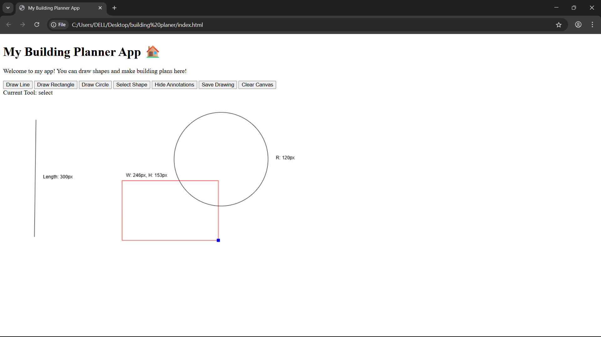

# Building Planner Assignment

## About This Project
Hi! I’m a beginner in web development, and this is my Building Planner app for the interview assignment. I built this app to learn HTML, CSS, JavaScript, and Vue.js. It lets you draw shapes and make building plans. It took me around 5-6 hours to finish, and I learned a lot while doing it!

### What My App Can Do
- **Draw Shapes**: You can draw lines, rectangles, and circles using the buttons at the top.
- **Select Shapes**: Click the "Select Shape" button to pick a shape, move it, resize it, or delete it (press the Delete key).
- **Show/Hide Annotations**: I added labels to show the size of shapes (like length for lines). You can show or hide them with a button.
- **Save and Load**: You can save your drawing (it stays even if you refresh the page) and clear the canvas with the "Clear Canvas" button.

## How to Run My App
1. **Get the Code**:git clone https://github.com/kdsgit06/building-planer.git

2. **Open It**:
- Go to the `building-planer` folder.
- Double-click `index.html` to open it in a browser (I tested it on Chrome).
- Or, if you’re using VS Code, you can install the "Live Server" extension and right-click `index.html` > "Open with Live Server".
3. **What You Need**:
- The app uses Vue.js, but I added it through a link (CDN), so you don’t need to install anything extra.

## How I Built It
- **What I Used**:
- I used Vue.js because the assignment asked for a lightweight framework.
- I used the HTML5 Canvas to draw shapes (I learned about it from a tutorial).
- I saved the drawings using LocalStorage because I’m not sure how to use a real database yet.
- **Files**:
- `index.html`: This has the layout, like the buttons and canvas.
- `style.css`: I added some fun colors and styling (I like pink and orange!).
- `app.js`: This has all the code to make the app work, like drawing and saving shapes.
- **How I Stored the Drawings**:
- I saved the shapes in LocalStorage as a list. For example:
 - Lines: `{ type: 'line', x1, y1, x2, y2 }`
 - Rectangles: `{ type: 'rectangle', x, y, width, height }`
 - Circles: `{ type: 'circle', x, y, radius }`
- **What I Learned**:
- I learned how to use the Canvas API to draw shapes.
- I found out how to use Vue.js to make the buttons work.
- I had trouble figuring out how to select shapes, but I found a solution on Stack Overflow.
- I’m still learning, so I didn’t handle some things (like if you draw a rectangle with negative size).

## Screenshots
Here are some pictures of my app!

### Drawing Some Shapes

### Selecting and Moving a Shape

### Showing Annotations

## Things I Could Improve
- I didn’t add test cases because I ran out of time, but I’d like to learn how to do that in the future.
- Sometimes the shapes can have negative sizes if you draw them in the wrong direction—I want to fix that later.
- I could add more shapes, like triangles, if I had more time.

## Final Thoughts
This was my first big web project, and I’m really proud of it! I hope you like my app. It was fun to build, even though I got stuck a few times. Thank you for checking it out!